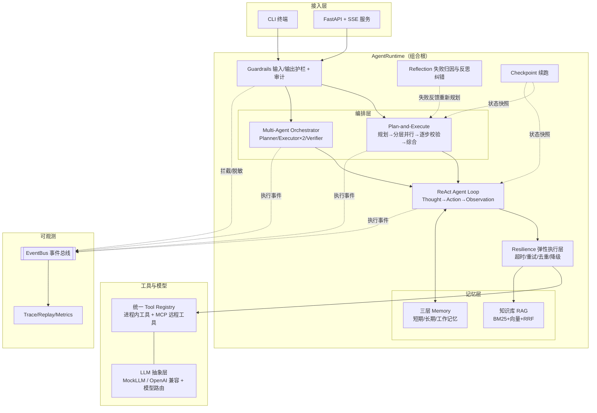

# AgentHarness —— 企业级 Agent 平台（核心能力实现）

从 0 到 1 实现的生产级 Agent Harness 与编排调度系统，覆盖 **Agent 执行链路、Multi-Agent 协同、
统一工具链与 MCP 协议、三层记忆与上下文工程、安全护栏、Trace/Replay 评估体系** 全链路。

> **核心特色：零依赖、可离线演示。** 核心包仅使用 Python 标准库，内置脚本化 MockLLM ——
> 无网络、无 API Key 也能完整跑通全部链路；一条环境变量即可切换任意 OpenAI 兼容模型（DeepSeek / 智谱 / Qwen / vLLM）。

```bash
python -m agent_harness demo        # 一键演示全部场景（离线可跑）
python -m agent_harness eval        # 22 个评测任务 + 实时指标报告
python -m agent_harness selfcheck   # 15 项核心能力自检
```

---

## 1. 总体架构



**执行与观测完全解耦**：所有组件只向 EventBus 广播事件，CLI / SSE / Trace 都只是事件订阅者，
可观测体系对核心链路零侵入。

## 2. 模块总览（目录即架构）

```
agent_harness/
├── harness/                 # ★ Agent 核心执行链路
│   ├── react.py             #   ReAct 循环：解析/工具调用/格式自修复/Checkpoint
│   ├── plan_execute.py      #   规划(DAG)→拓扑分层→并行执行→逐步校验→综合
│   ├── verifier.py          #   规则前置 + LLM 兜底的两层结果校验
│   ├── reflection.py        #   失败归因(planning/tool/context/model)→反馈注入
│   ├── state.py             #   显式可序列化 AgentState（Checkpoint 的前提）
│   └── checkpoint.py        #   SQLite 状态快照与断点续跑
├── multiagent/orchestrator.py  # ★ 角色分工/任务分发/纠错闭环/黑板一致性
├── tools/                   # ★ 统一 Tool Registry
│   ├── base.py              #   工具契约 + 轻量 JSON Schema 校验
│   ├── registry.py          #   动态注册/发现/统一调用（进程内 + MCP 解耦）
│   ├── execution.py         #   弹性执行层：超时/指数退避重试/防重复/降级
│   ├── builtin.py           #   12 个内置工具（含故障注入点）
│   └── mcp.py               #   手写最小 MCP：JSON-RPC 2.0 over stdio
├── memory/                  # ★ 三层记忆 + 混合检索原语
│   ├── memory.py            #   长期事实库(去重/合并/冲突) + 会话记忆 + Token 预算
│   └── retrieval.py         #   BM25 / Hash Embedding / RRF 融合
├── rag/rag.py               #   分块(按标题+窗口) → 双路索引 → 混合检索 → 相关性门槛
├── guardrails/guardrails.py #   注入拦截/敏感脱敏/泄露检测 + JSONL 审计
├── llm/                     #   MockLLM(脚本化场景) / OpenAI 兼容客户端 / 模型路由
├── observability/           #   Trace 落库 / Replay 确定性重放 / 评估指标
├── api/server.py            #   FastAPI + SSE 流式服务
├── runtime.py               #   组合根：装配/生命周期/会话管理
└── cli.py                   #   run/demo/eval/trace/tools/sessions/server
evals/tasks.jsonl            #   22 个评测任务（工具调用/RAG/规划/多智能体/记忆/护栏）
tests/                       #   18 个单元 + 端到端测试
```

## 3. 快速开始

要求：Python ≥ 3.10，无任何第三方依赖。

```bash
# 场景一：单目标执行（ReAct 模式）
python -m agent_harness run "查一下张三的年假余额，如果够的话帮他提交3天的年假申请"

# 场景二：Plan-and-Execute（无依赖步骤并行执行）
python -m agent_harness run "对比北京和上海明天的天气并给出出行建议" --mode plan_execute

# 场景三：Multi-Agent 协同（规划/执行/校验三角色）
python -m agent_harness run "对比北京和上海明天的天气并给出出行建议" --mode multi_agent

# 跨会话记忆：同一 session 两次运行，第二次自动召回身份信息
python -m agent_harness run "我叫李雷，是研发部的工程师" --session demo
python -m agent_harness run "我还剩几天年假？" --session demo

# 一键跑全部 10 个演示场景（含重试/降级/护栏/MCP）
python -m agent_harness demo
```

`--verbose` 可查看每次 LLM 调用的角色、模型、Token 与延迟明细。

## 4. 演示场景与对应能力

| 场景命令（demo 内置） | 演示的能力 |
|---|---|
| 查余额并提交 3 天年假 | 多轮工具调用链、业务规则校验（余额不足自动拒绝） |
| 年假顺延制度问答 | 知识库 RAG：混合检索 + 引用条款回答 |
| 查北京天气 | **自动重试**：天气接口首次调用注入超时故障，弹性层指数退避后恢复 |
| 搜 AI 行业新闻 | **自动降级**：news_search 服务下线 → 自动切换 web_search |
| 对比两地天气（plan_execute） | 任务拆解、无依赖步骤并行、逐步校验、结果综合 |
| 自我介绍 + 后续查询 | 长期记忆抽取/沉淀/召回（跨会话持久化） |
| 注入攻击指令 | **Guardrails 拦截**：不进入模型直接拒绝 + 审计留痕 |
| 5 千米换算英里 | **MCP 远程工具**：手写 JSON-RPC 2.0 over stdio 完整握手 |
| 多智能体模式 | Planner 分工 → research/ops 双执行者并行 → Verifier 核验 |

**故障注入说明**：`weather_api`（每会话首次必失败，验证重试）、`news_search`（永远失败且声明
fallback，验证降级）是刻意内置的故障点，用于在演示中可复现地验证弹性执行层。

## 5. 核心设计决策（深水区）

### 5.1 双模式 Agent Harness
- **ReAct**：`Thought → Action → Action Input → Observation` 循环。解析器容忍格式抖动；
  输出不合规时把解析错误回灌给模型自我修复；达到步数上限标记 incomplete 而非静默失败。
- **Plan-and-Execute**：规划产出步骤 DAG（规划后做 id 唯一/依赖存在/环检测，异常退化为单步）；
  拓扑分层后同层并发（asyncio.Semaphore 限流）；每步过校验器，失败走反思归因带反馈重试一次。
- **为什么状态显式化**：AgentState 全量可序列化是 Checkpoint 续跑、Trace 回放、断点恢复的共同前提。
  循环本身零隐藏状态 —— 可中断、可恢复、可重放。

### 5.2 弹性执行层（超时/重试/去重/降级）
统一收口在 `execute_tool()`，业务代码不感知：
1. **Schema 前置校验**：参数错误不落到工具层，返回结构化错误让模型自我修正；
2. **防重复调用**：同会话 (tool, args) 哈希成功缓存；同一失败重复出现时在 Observation 中注入
   "已失败 N 次，建议更换策略" 提示，抑制模型原地打转；
3. **分级重试**：仅对超时/`RetryableError` 指数退避重试（0.2s, 0.4s…），业务性错误直接失败（重试无意义）；
4. **降级链**：重试耗尽后自动切换声明的 fallback 工具，并在轨迹中记录 `degraded_from`。

### 5.3 统一 Tool Registry 与 MCP
- 进程内工具与远程 MCP 工具实现同一契约（name/description/params/run），调用方完全解耦；
- `mcp.py` 不依赖官方 SDK，手写 **JSON-RPC 2.0 over stdio** 的 initialize / tools/list / tools/call
  完整握手，远程 schema 原生接入统一校验器 —— 协议细节可直接在代码中查阅；
- 新增一个工具 = 实现一个类并注册，或启动一个 MCP Server —— 两条路径，一套调用。

### 5.4 三层记忆与 Context Engineering
- **长期记忆**：LLM 抽取 subject/key/value 事实 → 写入时相似度去重（阈值 0.86）、
  同属性冲突时新值覆盖并记录冲突事件；检索复用 BM25+向量+RRF，检索未命中回退最近记忆；
- **短期记忆**：超过 Token 预算自动触发 LLM 压缩为摘要，保留最近原文；
- **上下文组装**：`ContextPolicy` 按优先级（工作记忆 > 长期记忆 > 近期对话 > 历史摘要）
  在 Token 预算内动态裁剪注入范围 —— 注入什么、注入多少是策略不是硬编码。

### 5.5 RAG 检索链路
按二级标题分块 + 320 字符窗口 packing → BM25 与 256 维 Hash Embedding 双路索引 →
RRF (k=60) 融合 → **BM25 证据门槛**：完全没有词汇证据的向量召回视为噪声丢弃，
让上层"明确拒答"而不是拿着弱相关片段编造（幻觉治理的工程化落点）。

### 5.6 Guardrails 与审计
管道式规则（可插拔）：输入侧注入检测（block）/敏感信息脱敏（mask）；输出侧凭据泄露检测；
所有决策写 JSONL 审计文件。拦截发生在进入模型**之前** —— 注入类请求零 Token 成本。

### 5.7 评估与可观测
- Trace 双层结构（trace + span），LLM span 记录输出内容 → **Replay 确定性重放**：
  按调用序回放录制输出重跑任务，自动对比工具序列与答案（`trace replay <id>`）；
- 评测集 22 题（tool_calling / rag_qa / plan_execute / multi_agent / multi_turn_memory / guardrails），
  现场实时计算成功率、工具调用准确率、平均步数/延迟/Token，报告落盘 `.agent_data/reports/`。

## 6. 切换真实 LLM

```bash
export AGENT_LLM_PROVIDER=openai
export AGENT_LLM_API_BASE=https://api.deepseek.com/v1   # 任意 OpenAI 兼容端点
export AGENT_LLM_API_KEY=sk-xxxx
export AGENT_LLM_MODEL=deepseek-chat
export AGENT_LLM_CHEAP_MODEL=deepseek-chat              # 模型路由：简单步骤可用便宜模型
python -m agent_harness run "查一下张三的年假余额"       # Harness 侧零改动
```

模型路由策略：规划/校验/综合用强模型，普通执行步骤用 cheap_model（成本管控的落点之一）。
未配置 Key 时自动回落 MockLLM，演示永不中断。

## 7. 扩展：写一个新工具 / 新 MCP Server

```python
# 新增进程内工具：实现 BaseTool 并注册
class CrmQueryTool(BaseTool):
    name = "crm_query"
    description = "按客户名查询 CRM 商机"
    params = {"type": "object", "properties": {"customer": {"type": "string"}},
              "required": ["customer"], "additionalProperties": False}
    async def run(self, args, ctx):
        return ToolResult(ok=True, output=f"{args['customer']}：2 个进行中商机")
```

MCP 方式：实现 `tools/call` 逻辑后 `python -m agent_harness.tools.mcp` 即为标准 stdio MCP Server，
任何 MCP 客户端（Claude Desktop 等）都可直接连接 —— 本仓库的 MCP 实现同时是服务端与客户端。

## 8. 测试与质量

```bash
python -m agent_harness selfcheck   # 15 项能力自检（零依赖）
python -m pytest tests/ -q          # 18 个单元/端到端测试（需 pytest）
python -m agent_harness eval        # 22 任务评测：当前 22/22 通过、工具准确率 100%
```

## 9. 生产化路线图

- 检索：Hash Embedding → bge-m3 + Milvus/Weaviate（`VectorIndex` 接口已对齐）
- Token：估算器 → tiktoken/厂商 tokenizer（`estimate_tokens` 单点替换）
- 可观测：内置 Trace → OpenTelemetry / Langfuse 导出（事件结构已对齐）
- 安全：规则护栏 → 规则 + 分类模型混合；工具沙箱化与权限分级
- 编排：单进程 asyncio → 分布式任务队列（步骤级幂等已具备：工具去重 + Checkpoint）
